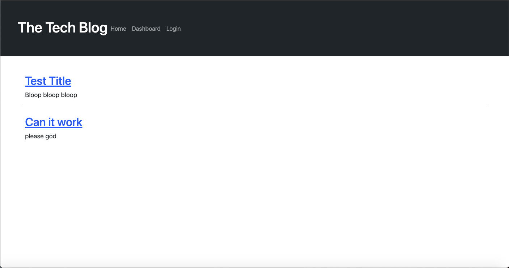
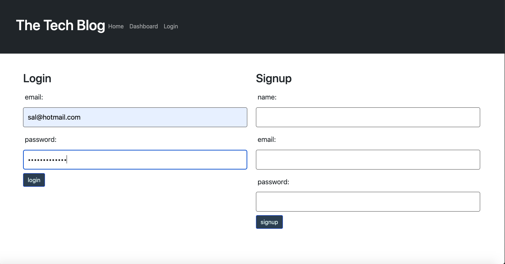
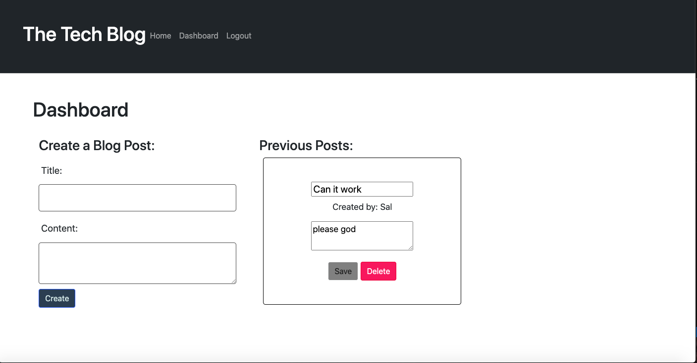
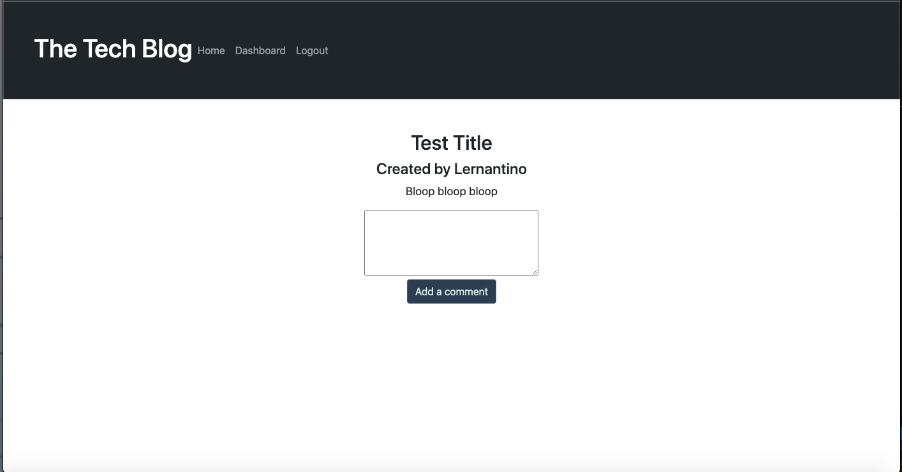

# Tech Blog Site

## Description

Have you ever wanted to have a reddit style forum blog for developers to share tips, tricks, or  simply just share ideas? This blog provides that perfect space for developers to come together, communicate, and share ideas back and forth. 

This is a CMS-style blog site that allows users to log in to their account and to create, edit and delete posts, as well as comment on other's posts. 

Your app will follow the MVC paradigm in its architectural structure, using Handlebars.js as the templating language, Sequelize as the ORM, and the express-session npm package for authentication.

## Technology Used

This app uses Handlebars.js, Sequelize, and the express-session npm package for authentication. 

## Installation

To install the required dependencies, run the following command:

`npm install` or `npm i`

## Mock-Up

The following are screenshots demonstrating the general layout and functionality of the site:

* 
* 
* 
* 

## Deployed Site Link

[Deployed Site via Heroku](https://shrouded-mesa-82538.herokuapp.com/)

## Questions

Feel free to contact me on my [GitHub](https://github.com/gabrielaortiz6/blog-site) if you have any questions or concerns.

---
© 2023 edX Boot Camps LLC. Confidential and Proprietary. All Rights Reserved.
